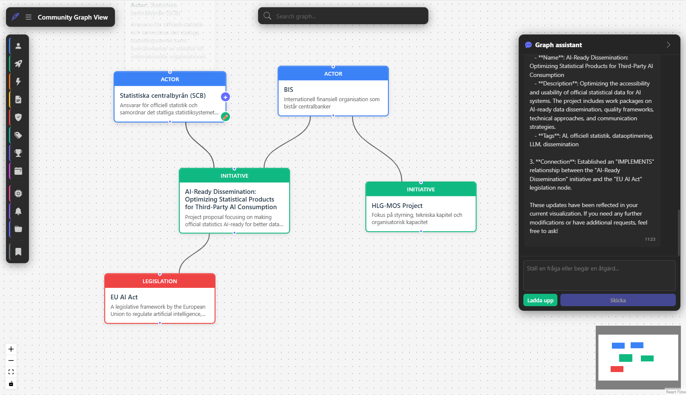

# Community Knowledge Sharing

AI-powered knowledge sharing for communities with graph visualization, conversational chat, and intelligent document analysis.



## Overview

This system helps organizations avoid overlapping investments by making visible:
- Ongoing initiatives and projects
- Resources and capabilities
- Connections between actors, legislation, and themes

**Key Features:**
- **AI-Powered Chat:** Natural language interface with Claude or OpenAI for exploring and managing the knowledge graph
- **Multi-Provider Support:** Switch between Claude (Anthropic) and OpenAI backends
- **Multi-Language Support:** English and Swedish UI with language selectable via URL or startup
- **Document Upload:** Upload PDF, Word, or text documents for automatic entity extraction
- **Interactive Visualization:** React Flow graph with drag-and-drop, zoom, and pan
- **Node Proposals:** LLM suggests entities with duplicate detection, user confirms before adding
- **ChatGPT Widget:** Embeddable widget for use in ChatGPT or other interfaces
- **Save Views:** Create and share custom graph views
- **Data Management:** Example datasets with easy loading from files or URLs

**Tech Stack:**
- **Frontend:** React + React Flow + Zustand (monorepo with npm workspaces)
- **Backend:** FastAPI + FastMCP (Python) with NetworkX + JSON
- **AI:** Claude or OpenAI for natural language understanding and entity extraction
- **Graph storage:** NetworkX in-memory + JSON persistence
- **Similarity search:** sentence-transformers + Levenshtein distance

## Project Structure

```
/backend                          # Python backend directory
  /api_host                       # FastAPI server host
    server.py                     # Main server with REST, MCP, and static files
    config.py                     # Server configuration
  /core                           # Core graph data structures
    storage.py                    # NetworkX graph operations
    models.py                     # Node/Edge data models
    vector_store.py               # Similarity search
  /service                        # Graph service layer
    service.py                    # High-level graph operations
    rest_api.py                   # REST API router
    mcp_tools.py                  # MCP tool definitions
  /ui                             # Chat and document handling
    chat_service.py               # LLM chat with tool execution
    document_service.py           # Document parsing
    rest_api.py                   # Chat REST endpoints
  llm_providers.py                # LLM provider abstraction
  chat_logic.py                   # Chat processing logic
/config                           # Configuration files
  schema_config.json              # Node types, relationships, presentation
  federation_config.json          # Startup-only federation graph connections
/data                             # Graph data
  /examples                       # Example datasets (tracked in git)
    default.json                  # Default example dataset
  /active                         # Active data used at runtime (git-ignored)
    graph.json                    # Currently active graph file
/frontend                         # Frontend applications
  /web                            # React web application
    /src/components               # UI components (ChatPanel, etc.)
    /src/i18n                     # Internationalization (en, sv)
    /src/services                 # API client
    /src/store                    # Zustand state
    /tests                        # Unit and e2e tests
  /widget                         # ChatGPT embeddable widget
/packages                         # Shared packages
  /ui-graph-canvas                # Shared React Flow component
/scripts                          # Utility scripts
/docs                             # Documentation
  DATA_MANAGEMENT.md              # Graph data management guide
  EVENT_SUBSCRIPTIONS.md          # Webhook/event system docs
  DEPLOYMENT_GUIDE.md             # Deployment documentation
  FEDERATED_GRAPH_DESIGN.md       # Federated multi-graph architecture proposal
start-dev.sh                      # Development startup script
LLM_PROVIDERS.md                  # LLM configuration guide
```

## Metamodel

The metamodel defines two categories of node types:

### Domain Node Types (configurable via `config/schema_config.json`)

These represent the knowledge domain and can be customized per deployment:

- **Actor** (blue) - Organizations, agencies, individuals
- **Initiative** (green) - Projects, programs, collaborative activities
- **Capability** (orange) - Capabilities, competencies, skills
- **Resource** (yellow) - Reports, software, tools, datasets
- **Legislation** (red) - Laws, directives (NIS2, GDPR, etc.)
- **Theme** (teal) - AI strategies, data strategies, themes
- **Goal** (indigo) - Strategic objectives and targets
- **Event** (fuchsia) - Conferences, workshops, milestones

### System Node Types (foundational to the application)

These are integral to core application functionality:

- **SavedView / VisualizationView** (gray) - Saved graph view snapshots
- **EventSubscription** (violet) - Webhook subscriptions for graph mutation events
- **Agent** (pink) - AI agent configurations (runtime not implemented)
- **Groups** - Visual grouping of nodes in the canvas

### Relationships
- BELONGS_TO, IMPLEMENTS, PRODUCES, GOVERNED_BY, RELATES_TO, PART_OF, AIMS_FOR

## Quick Start

### Development Mode (Recommended)

Start all services with a single command:

```bash
# Set your API key (pick one)
export OPENAI_API_KEY=sk-xxxxx        # For OpenAI
export ANTHROPIC_API_KEY=sk-ant-xxxxx # For Claude

# Start everything (default language: English)
./start-dev.sh

# Start with Swedish UI
./start-dev.sh --lang sv

# Start with a specific dataset
./start-dev.sh --data data/examples/default.json

# Start with data from a URL
./start-dev.sh --data https://example.github.io/data/graph.json
```

The script will:
- Check for and set up active graph data (copies example data on first run)
- Set up Python virtual environment and install dependencies
- Install npm dependencies (workspaces)
- Build web app and widget
- Start FastAPI server on http://localhost:8000

**Available endpoints after startup:**
| Endpoint | Description |
|----------|-------------|
| http://localhost:8000/web/ | Web application |
| http://localhost:8000/widget/ | ChatGPT widget |
| http://localhost:8000/api/ | REST API |
| http://localhost:8000/ui/ | Chat API |
| http://localhost:8000/mcp | MCP endpoint |
| http://localhost:8000/health | Health check |
| http://localhost:8000/federation/status | Federation cache/status |
| http://localhost:8000/federation/sync | Trigger federation sync (POST) |

### Manual Start

If you prefer to start services separately:

**Backend:**
```bash
python -m venv venv
source venv/bin/activate  # Windows: venv\Scripts\activate
pip install -r backend/requirements.txt
uvicorn backend.api_host.server:get_app --factory --reload --port 8000
```

**Frontend (development with hot reload):**
```bash
npm install
npm run dev  # Starts Vite dev server on http://localhost:5173
```

Note: In development mode, the frontend runs on port 5173 with hot reload. For production, run `npm run build` and access via `/web/` on the backend server.

## Language Configuration

The application supports English and Swedish. Language can be set in three ways:

1. **URL parameter** (highest priority): `http://localhost:8000/web/?lang=sv`
2. **Startup flag**: `./start-dev.sh --lang sv`
3. **Schema config** (`config/schema_config.json`): `"default_language": "en"`

The language setting affects the UI labels, chat placeholders, notifications, and welcome message. The AI chat assistant responds in whatever language the user writes in.
Federation topology can be configured at startup with `FEDERATION_FILE` (default: `config/federation_config.json`). This is admin-only configuration and is not editable via GUI/chat tools.


Example federation depth setup (installation policy):

```json
{
  "federation": {
    "enabled": true,
    "max_traversal_depth": 4,
    "depth_levels": [1, 2, 4],
    "graphs": [
      {
        "graph_id": "esam-main",
        "display_name": "eSam",
        "enabled": true,
        "max_depth_override": 2,
        "endpoints": { "graph_json_url": "https://example.org/graph.json" }
      }
    ]
  }
}
```

UI behavior:
- Only configured selectable levels are shown (bounded by effective max depth).
- If only one level is available, the depth selector is hidden.
- Search labels show `<GraphName>: <NodeName>` only when multiple graphs are available.

You can also name the local graph in `graph.json` metadata:

```json
{
  "metadata": {
    "graph_name": "My Local Collaboration Graph"
  }
}
```

## Data Management

Graph data is stored separately from the codebase:
- **Example data** lives in `data/examples/` (tracked in git)
- **Active data** lives in `data/active/graph.json` (git-ignored)

On first run, the default example data is automatically copied to the active location. Use `--data` to load different datasets. See [docs/DATA_MANAGEMENT.md](./docs/DATA_MANAGEMENT.md) for details.
For upcoming multi-instance capabilities, see [docs/FEDERATED_GRAPH_DESIGN.md](./docs/FEDERATED_GRAPH_DESIGN.md).

## LLM Provider Configuration

The system automatically detects which provider to use based on available API keys:

```bash
# Just set your API key - provider is auto-detected
export OPENAI_API_KEY=sk-xxxxx           # Auto-selects OpenAI
# OR
export ANTHROPIC_API_KEY=sk-ant-xxxxx    # Auto-selects Claude
```

**Manual selection:**
```bash
export LLM_PROVIDER=claude   # Force Claude
export LLM_PROVIDER=openai   # Force OpenAI
```

See [LLM_PROVIDERS.md](./LLM_PROVIDERS.md) for detailed configuration.

## Testing

```bash
# All Python tests
python -m pytest backend

# JavaScript tests
npm test

# E2E tests
npm run test:e2e

# All tests
npm run test:all
```

## User Scenarios

### Document Analysis
1. Upload a project description (PDF/Word)
2. Ask "which organizations are mentioned?"
3. AI extracts entities with duplicate detection
4. Review and approve suggested additions
5. New nodes appear in the graph

### Finding Similar Projects
1. Upload your project proposal
2. Ask "are there similar projects?"
3. System shows matching projects with similarity scores
4. Decide to add your project or join existing initiative

### Exploring the Graph
1. Use the chat panel to search: "search AI projects"
2. Graph displays matching nodes
3. Click nodes to see details and connections
4. Save custom views for later

## ChatGPT Widget Integration

The widget can be embedded in ChatGPT or other platforms:

```html
<script src="https://your-server/widget/widget.iife.js"></script>
<link rel="stylesheet" href="https://your-server/widget/style.css">
<community-graph-widget api-url="https://your-server"></community-graph-widget>
```

The widget provides:
- Graph visualization
- Chat interface
- MCP tool execution

## Event Subscriptions & Webhooks

The system supports webhook notifications for graph mutations:

- **EventSubscription nodes** define webhook targets and filters
- **Events** are generated when nodes are created, updated, or deleted
- **Loop prevention** via `event_origin` and `event_session_id` tracking
- **Retry logic** with exponential backoff for failed deliveries

Create subscriptions via the web UI (right-click on canvas) or API. See [docs/EVENT_SUBSCRIPTIONS.md](./docs/EVENT_SUBSCRIPTIONS.md) for detailed documentation.

## Security

- Max 10 nodes per delete operation
- Confirmation required for deletions
- Community-based isolation
- No personal data handling

## Development

See [backend/DEVELOPMENT.md](./backend/DEVELOPMENT.md) for detailed development guide including:
- Architecture overview
- Adding new MCP tools
- Testing strategies
- API documentation

## License

MIT License - see LICENSE for details
