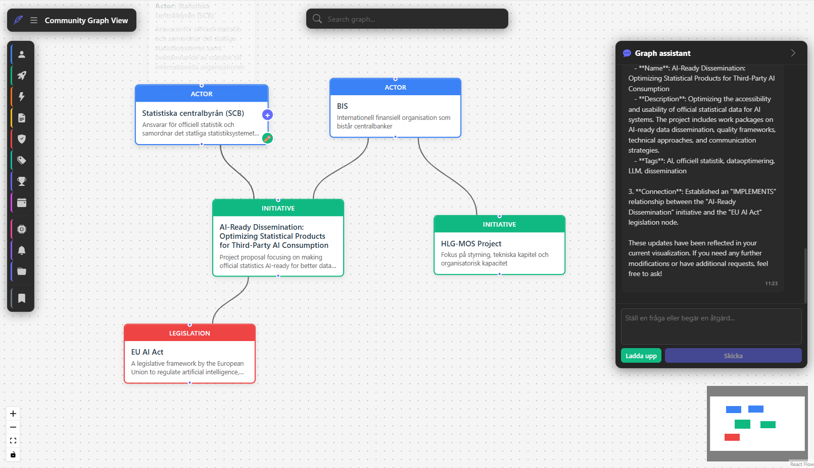

# Community Knowledge Sharing

AI-powered knowledge sharing for communities with graph visualization, conversational chat, and intelligent document analysis.



## Overview

This system helps organizations avoid overlapping investments by making visible:
- Ongoing initiatives and projects
- Resources and capabilities
- Connections between actors, legislation, and themes

**Key Features:**
- **AI-Powered Chat:** Natural language interface with Claude or OpenAI for exploring and managing the knowledge graph
- **Multi-Provider Support:** Switch between Claude (Anthropic) and OpenAI backends
- **Multi-Language Support:** English and Swedish UI with language selectable via URL or startup
- **Document Upload:** Upload PDF, Word, or text documents for automatic entity extraction
- **Interactive Visualization:** React Flow graph with drag-and-drop, zoom, and pan
- **Node Proposals:** LLM suggests entities with duplicate detection, user confirms before adding
- **ChatGPT Widget:** Embeddable widget for use in ChatGPT or other interfaces
- **Save Views:** Create and share custom graph views
- **Data Management:** Example datasets with easy loading from files or URLs

**Tech Stack:**
- **Frontend:** React + React Flow + Zustand (monorepo with npm workspaces)
- **Backend:** FastAPI + FastMCP (Python) with NetworkX + JSON
- **AI:** Claude or OpenAI for natural language understanding and entity extraction
- **Graph storage:** NetworkX in-memory + JSON persistence
- **Similarity search:** sentence-transformers + RapidFuzz

## Project Structure

```
/backend                          # Python backend directory
  /api_host                       # FastAPI server host
    server.py                     # Main server with REST, MCP, and static files
    config.py                     # Server configuration
  /core                           # Core graph data structures
    storage.py                    # NetworkX graph operations
    models.py                     # Node/Edge data models
    vector_store.py               # Similarity search
  /service                        # Graph service layer
    service.py                    # High-level graph operations
    rest_api.py                   # REST API router
    mcp_tools.py                  # MCP tool definitions
  /ui                             # Chat and document handling
    chat_service.py               # LLM chat with tool execution
    document_service.py           # Document parsing
    rest_api.py                   # Chat REST endpoints
  llm_providers.py                # LLM provider abstraction
  chat_logic.py                   # Chat processing logic
/config                           # Configuration profiles
  /default                        # Default profile (base, always required)
    schema_config.json            # Node types, relationships, presentation
    federation_config.json        # Federation graph connections
    .env.example                  # Environment variable template
  /scb                            # SCB (Statistics Sweden) demo profile
    schema_config.json            # Statistical metadata model
  /test                           # Test profile
    schema_config.json            # Minimal config for testing
  profile-utils.sh                # Shared profile resolution utilities
/data                             # Graph data
  /examples                       # Example datasets (tracked in git)
    default.json                  # Default example dataset
  /active                         # Active data used at runtime (git-ignored)
    graph.json                    # Currently active graph file
/frontend                         # Frontend applications
  /web                            # React web application
    /src/components               # UI components (ChatPanel, etc.)
    /src/i18n                     # Internationalization (en, sv)
    /src/services                 # API client
    /src/store                    # Zustand state
    /tests                        # Unit and e2e tests
  /widget                         # ChatGPT embeddable widget
/packages                         # Shared packages
  /ui-graph-canvas                # Shared React Flow component
/scripts                          # Utility scripts
/docs                             # Documentation
  DATA_MANAGEMENT.md              # Graph data management guide
  EVENT_SUBSCRIPTIONS.md          # Webhook/event system docs
  PROFILES.md                     # Configuration profiles guide
  DEPLOYMENT_GUIDE.md             # Deployment documentation
  FEDERATED_GRAPH_DESIGN.md       # Federated multi-graph architecture
start-dev.sh                      # Development startup script
LLM_PROVIDERS.md                  # LLM configuration guide
```

## Metamodel

The metamodel defines two categories of node types. Node types, relationships, colors, icons, and AI prompts are all **configurable per profile** via `schema_config.json`. See [docs/PROFILES.md](./docs/PROFILES.md) for the full guide.

### Domain Node Types (configurable via profile)

The default profile includes these domain types:

- **Actor** (blue) - Organizations, agencies, individuals
- **Initiative** (green) - Projects, programs, collaborative activities
- **Capability** (orange) - Capabilities, competencies, skills
- **Resource** (yellow) - Reports, software, tools, datasets
- **Legislation** (red) - Laws, directives (NIS2, GDPR, etc.)
- **Theme** (teal) - AI strategies, data strategies, themes
- **Goal** (indigo) - Strategic objectives and targets
- **Event** (fuchsia) - Conferences, workshops, milestones
- **Data** (cyan) - Datasets, registers, APIs, data sources
- **Risk** (red) - Identified risks, threats, or vulnerabilities

Other profiles can add domain-specific types. For example, the SCB profile adds: Dataset, Hållpunkt, Undersökning, Variabel, Värdemängd, Population, Klassifikation.

All domain nodes support **subtypes** for finer sub-classification within each node type (e.g., an Actor can be tagged as "Government agency", "Municipality", "Steering group"). Subtypes are optional, stored as a list, and the UI provides autocomplete with case normalization based on existing subtypes in the graph.

### System Node Types (foundational to the application)

These are integral to core application functionality:

- **SavedView / VisualizationView** (gray) - Saved graph view snapshots
- **EventSubscription** (violet) - Webhook subscriptions for graph mutation events
- **Agent** (pink) - AI agent configurations (runtime not implemented)
- **Groups** - Visual grouping of nodes in the canvas

### Relationships
- Default: BELONGS_TO, IMPLEMENTS, PRODUCES, GOVERNED_BY, RELATES_TO, PART_OF, AIMS_FOR
- Profiles can define additional relationship types (e.g., MEASURES, DESCRIBES, USES, DERIVED_FROM)

## Quick Start

### Development Mode (Recommended)

Start all services with a single command:

```bash
# Set your API key (pick one)
export OPENAI_API_KEY=sk-xxxxx        # For OpenAI
export ANTHROPIC_API_KEY=sk-ant-xxxxx # For Claude

# Start everything (default profile, English)
./start-dev.sh

# Start with a specific profile
./start-dev.sh --profile scb

# Start with Swedish UI
./start-dev.sh --lang sv

# Combine profile, language, and data
./start-dev.sh --profile scb --lang sv --data data/examples/default.json

# Start with data from a URL
./start-dev.sh --data https://example.github.io/data/graph.json
```

The script will:
- Check for and set up active graph data (copies example data on first run)
- Set up Python virtual environment and install dependencies
- Install npm dependencies (workspaces)
- Build web app and widget
- Start FastAPI server on http://localhost:8000

**Available endpoints after startup:**
| Endpoint | Description |
|----------|-------------|
| http://localhost:8000/web/ | Web application |
| http://localhost:8000/widget/ | ChatGPT widget |
| http://localhost:8000/api/ | REST API |
| http://localhost:8000/ui/ | Chat API |
| http://localhost:8000/mcp | MCP endpoint |
| http://localhost:8000/health | Health check |
| http://localhost:8000/federation/status | Federation cache/status |
| http://localhost:8000/federation/sync | Trigger federation sync (POST) |

### Manual Start

If you prefer to start services separately:

**Backend:**
```bash
python -m venv venv
source venv/bin/activate  # Windows: venv\Scripts\activate
pip install -r backend/requirements.txt
uvicorn backend.api_host.server:get_app --factory --reload --port 8000
```

**Frontend (development with hot reload):**
```bash
npm install
npm run dev  # Starts Vite dev server on http://localhost:5173
```

Note: In development mode, the frontend runs on port 5173 with hot reload. For production, run `npm run build` and access via `/web/` on the backend server.

## Language Configuration

The application supports English and Swedish. Language can be set in three ways:

1. **URL parameter** (highest priority): `http://localhost:8000/web/?lang=sv`
2. **Startup flag**: `./start-dev.sh --lang sv`
3. **Schema config** (`config/default/schema_config.json`): `"default_language": "en"`

The language setting affects the UI labels, chat placeholders, notifications, and welcome message. The AI chat assistant responds in whatever language the user writes in.

## Configuration Profiles

Profiles allow you to run the application with different metadata models, node types, and AI prompts. Each profile is a directory under `config/` that can override the default configuration.

```bash
# Start with the SCB (Statistics Sweden) profile
./start-dev.sh --profile scb

# Profiles available out of the box:
#   default  - General community knowledge graph
#   scb      - Statistical metadata model (Dataset, Undersökning, Variabel, etc.)
#   test     - Minimal config for testing
```

Each profile can contain:
- `schema_config.json` — Node types, relationships, colors, icons, and AI prompts
- `federation_config.json` — Federation topology
- `.env` — Secrets and environment overrides (git-ignored)
- `graph.json` — Seed data for initial setup