# User Guide

Community Knowledge Sharing is a visual, AI-powered platform for building and exploring
shared knowledge graphs. This guide covers all user-facing features.

---

## Contents

1. [The main interface](#1-the-main-interface)
2. [Working with the graph](#2-working-with-the-graph)
   - [Creating nodes](#21-creating-nodes)
   - [Creating edges](#22-creating-edges)
   - [Editing and deleting](#23-editing-and-deleting)
   - [Right-click context menu](#24-right-click-context-menu)
   - [Groups and annotations](#25-groups-and-annotations)
   - [Saved views](#26-saved-views)
   - [Agents](#27-agents)
   - [Recent nodes (navigation trail)](#28-recent-nodes-navigation-trail)
3. [Search](#3-search)
4. [AI Chat](#4-ai-chat)
   - [Asking questions](#41-asking-questions)
   - [Adding nodes through chat](#42-adding-nodes-through-chat)
   - [Node proposals and duplicate detection](#43-node-proposals-and-duplicate-detection)
   - [Skills](#44-skills)
   - [Node marking](#45-node-marking)
   - [Document upload](#46-document-upload)
5. [Session menu and settings](#5-session-menu-and-settings)
   - [Collaborating in a session](#51-collaborating-in-a-session)
   - [Recent activity (audit log)](#52-recent-activity-audit-log)
6. [Federation — searching across multiple graphs](#6-federation--searching-across-multiple-graphs)
7. [Interactive guides](#7-interactive-guides)
8. [Connecting external AI tools via MCP](#8-connecting-external-ai-tools-via-mcp)
   - [Available MCP tools](#81-available-mcp-tools)
   - [Connecting](#82-connecting)
   - [Live visualization control via session ID](#83-live-visualization-control-via-session-id)
   - [External pulse triggers](#84-external-pulse-triggers)
9. [On a phone](#9-on-a-phone)

---

## 1. The main interface

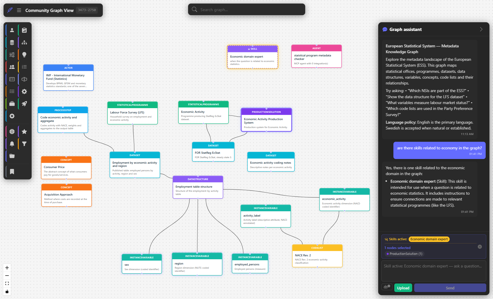
*The main interface: left toolbar (node types and tools), graph canvas (centre), search bar (top), chat panel (right). Skill nodes and Agent nodes are visible in the graph alongside domain content.*

The application is divided into four main areas:

| Area | Purpose |
|------|---------|
| **Left toolbar** | Create new nodes by clicking a node type icon; system tools (save view, minimap, etc.) at the bottom |
| **Graph canvas** | Visual graph — drag nodes, zoom, pan, right-click for the context menu |
| **Top bar** | Search, session menu (☰), and session ID for connecting external AI clients |
| **Chat panel** | Conversational AI assistant (right side, collapsible via the → arrow) |

---

## 2. Working with the graph

### 2.1 Creating nodes

Click a node type icon in the left toolbar to open the creation dialog.

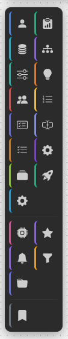
*The left toolbar. Each icon represents a node type defined by the active profile. Domain types are listed first; system types (Agent, EventSubscription, Skill, SavedView, etc.) appear below a divider.*

Fill in the node fields and click **Save**. The node appears in the canvas immediately.

**Subtypes** — most node types support an optional subtype tag (e.g. "Government agency"
for an Actor, or "Research project" for an Initiative). The field autocompletes based on
subtypes already in the graph, helping maintain consistent terminology across the team.

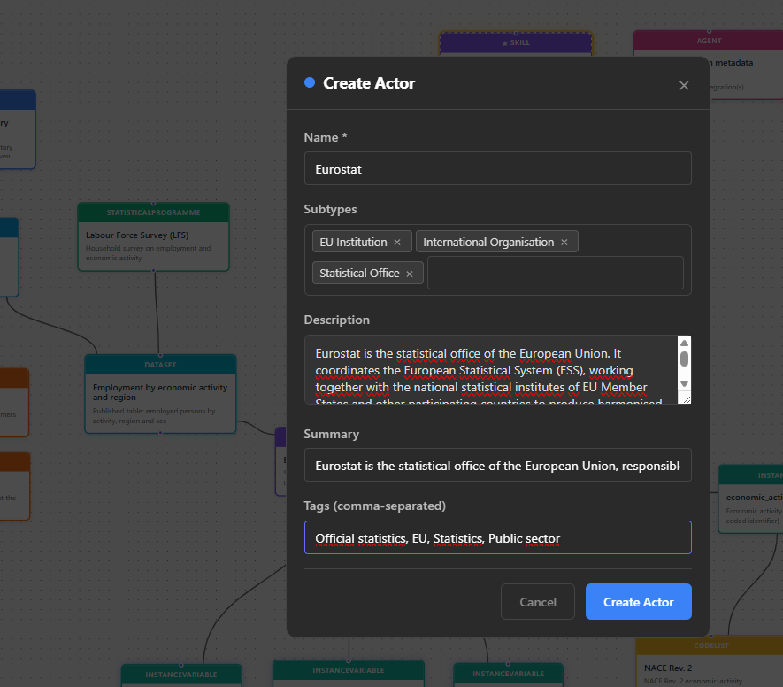
*The node creation dialog. Fields shown depend on the node type and active profile.*

**Skill nodes** use a specialised form with fields for the SKILL.md instruction set
(name, description, when-to-use, content, allowed tools, version).

You can also drag a node type icon from the toolbar and drop it anywhere on the canvas
to create a node at that position.

### 2.2 Creating edges

Hover over a node until the connection handle appears on its border, then drag to a target
node. A dialog lets you select the relationship type.

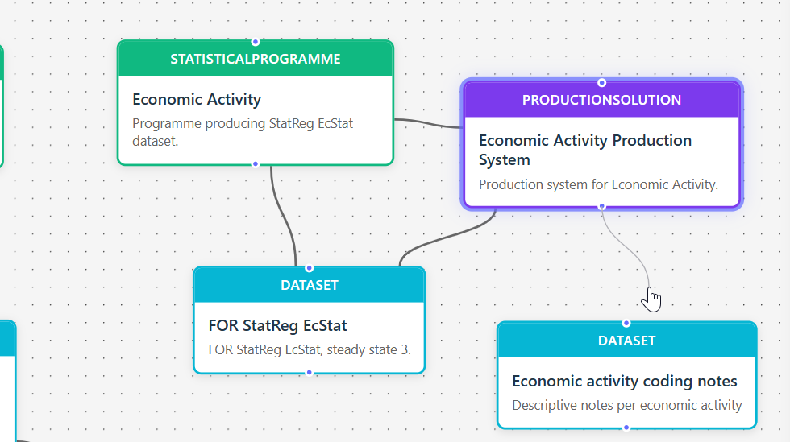
*Hover over a node to reveal the connection handle (small circle), then drag to the target node to create an edge.*

**Edge appearance:** Right-click an edge → **Edit** to open the connection dialog.
Besides the relationship type and label, the **Appearance** section
lets you control how the edge is drawn on the canvas:

- **Direction** — draw an arrowhead toward the target, toward the source, at both ends,
  or none.
- **Arrowhead** — filled or open arrow style.
- **Thickness** — line width from 1 to 12 px.
- **Custom colour** — override the default grey with any colour (the arrowheads follow it).
- **Animate (pulse)** — animate the edge with a flowing, pulsing stroke instead of a
  static line.

Edges without any appearance settings keep the default look (thin grey line, no arrows).

### 2.3 Editing and deleting

**Edit:** Double-click a node to open its detail dialog, then click **Edit**. All
fields are editable. The detail dialog also has a **History** tab showing the
read-only change log for that node (see [5.2](#52-recent-activity-audit-log)).

**Delete node:** Right-click → **Delete**, or select a node and press **Delete**.
Deletions require confirmation. A single operation can remove up to 10 nodes at once.

**Delete edge:** Select an edge and press **Delete**, or right-click the edge.

### 2.4 Right-click context menu

On a touch screen, a **long press** (about half a second, without dragging) is the
equivalent of a right-click and opens the same menu described below, on a node, an edge,
the canvas background, or a multi-node selection. A one-finger drag pans the canvas
instead of drawing a selection box; pinch to zoom; tap to select; double-tap a node to
open its detail dialog, same as a double-click.

Right-clicking a node opens the context menu:

- **Edit** — open the edit dialog
- **Hide** — remove the node from the current view (does not delete it from the graph)
- **Dim node / Restore node** — fade the node instead of hiding it: it stays visible, at
  reduced prominence, so you keep its position as context. Restore brings it back to full
  visibility.
- **Dim incident edges / Restore incident edges** — fade every connection touching this
  node (only offered when it has any), to de-emphasise its relationships without hiding
  the node or the edges' other endpoints.
- **Expand** — load all nodes directly connected to this node into the canvas
- **Select all nodes of the same type** — select every node of this node's type across the
  whole visualization, including ones scrolled outside the current viewport
- **Select related nodes** — select this node together with every node it is directly
  connected to
- **View change history** — open the node's detail dialog straight to its **History** tab,
  showing the read-only change log for that node (see [5.2](#52-recent-activity-audit-log)).
  When the deployment retains no history for the node, the tab shows a "no history" message.
- **Custom actions** — schema-defined items per node type, e.g. "Open in SSPCloud" that
  substitutes a field value into a URL and opens it in a new tab
- **Delete** — remove the node permanently (shown in red, requires confirmation)

Newly added nodes (for example from **Expand**) are placed next to the node you expanded
from, rather than stacking at the top-left corner.

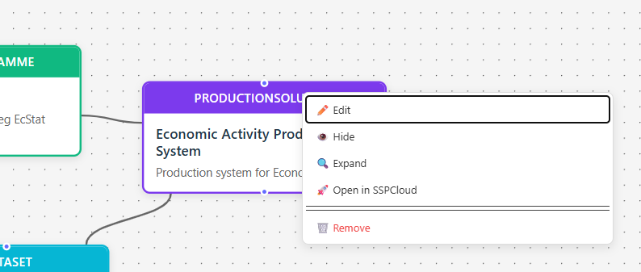
*Context menu on a ProductionSolution node. "Open in SSPCloud" is a custom action defined in the schema's `context_menu` configuration.*

Right-clicking on the **canvas background** offers quick-create options:
- Create EventSubscription (webhook)
- Create Agent

Right-clicking an **edge** opens: **Change type** (a submenu listing every relationship
type defined in the schema; the edge's current type is shown checked and cannot be
re-selected), **Edit**, **Hide**, **Dim connection / Restore connection**, and **Delete**.
If the edge is part of a larger multi-edge selection, dim/restore applies to the whole
selection rather than just the one you right-clicked.

Right-clicking a **selection of multiple nodes** shows bulk actions: Show only these,
Select all nodes of the same type, an **Organize** submenu, Hide all, **Dim selected /
Restore selected**, **Dim incident edges / Restore incident edges** (every connection
touching any of the selected nodes, de-duplicated), Delete all. "Select
all nodes of the same type" extends the selection to every node whose type matches any
type already in the selection. **Organize** opens a submenu of arrangements — Auto-tidy,
Cluster, List horizontally, List vertically, or Arrange as tree — keeping the nodes
centred where they already sit. **Auto-tidy** is the one-click option: it picks a sensible
structure for you — a tree when the selected nodes are connected in a hierarchy,
otherwise a per-type grouping — and always lays them out overlap-free. The same
arrangements are available from the keyboard: press **Ctrl/Cmd+O** with a
multi-selection, then **A** (auto-tidy), **C** (cluster), **H** (horizontal), **V**
(vertical) or **T** (tree).

The same right-click menu also offers **Align** and **Distribute**, and — unlike
Organize — both work across a selection mixing graph nodes with annotations (notes,
labels, shapes, text, icons and the rest), not graph nodes alone. **Align** opens a
submenu of six edge/centre choices: Align left, Align horizontal centers, Align right,
Align top, Align vertical middles, Align bottom, each computed from the selection's
actual on-canvas boxes. **Distribute** offers Distribute horizontally and Distribute
vertically, spacing the selection with equal gaps between neighbouring boxes while the
two outermost members stay put; it only appears once 3 or more members are eligible; a
2-member selection can only be aligned. A locked annotation, one someone else is
currently editing, and one already attached to another node or annotation (dragged
close enough to snap onto it) are left out of either action — attached items keep
following whatever they're attached to instead of being moved independently, which
would otherwise fight the very effect that keeps them glued in place. When any of the
selection was left out this way, a brief notice says why.

Every context menu supports keyboard use: opening one moves focus to its first item,
**↑/↓** move between items and wrap at the ends, **Home/End** jump to the first/last
item, and **Escape** closes the menu and returns focus to wherever it was before the
menu opened. A submenu trigger (**Change type**, **Organize**, **Align**, **Distribute**)
also opens with **→** or **Enter**, and closes with **←** or **Escape** without closing
the menu it belongs to.

Moving nodes can be undone: **Ctrl/Cmd+Z** reverses the last node move (a drag, an
Organize arrangement, or an Align/Distribute), and **Ctrl/Cmd+Shift+Z** (or
**Ctrl/Cmd+Y**) reapplies it.
The undo history covers the layout you are looking at, so it is discarded whenever the
canvas is repopulated — switching session, loading a saved view, or clearing the board.
Moves made by other people in the session, or by an assistant arranging the view, do not
discard it: your undo still reverses your own last move.

### 2.5 Groups and annotations

Nodes can be visually grouped by dragging them into a Group container (create one from
the toolbar or via the group icon). Groups help organise large graphs without affecting
the underlying data model.

A group's right-click menu offers a colour and **Delete Group**. Deleting a group removes
the box only — the nodes inside it stay on the canvas, exactly where they appear, and are
simply no longer grouped. The deletion is recorded in the session panel
(see [Recent activity](#52-recent-activity-audit-log)) and can be undone from there while it
is still your most recent undoable action.

If you used to reach for **Hide Group**, it is gone. It never hid anything: it did exactly
what **Delete Group** does, under a label that suggested otherwise. Use **Delete Group** —
it is the same action you were already getting, named for what it does.

A group box can also be locked, the same way an annotation can. A locked group stays where
it is: you cannot drag it, resize it, rename it by double-clicking, recolour it, or delete
it. Its right-click menu has a single action — **Unlock** — and choosing it gives the full
menu back. Locking is done by an assistant or an agent on your behalf, so a group you did
not lock yourself may already be locked when you open a shared board.

Locking protects the group box, not what is inside it. Dragging a node into or out of a
locked group still works, so the group's membership can change even while the box cannot.

Alongside groups, you can add free-floating **annotations** to a session by right-clicking
an empty area of the canvas and choosing one of:

- **Note** — a resizable sticky note for longer comments. Double-click to edit its text;
  right-click for a colour, to change the text size, to rotate it, or to delete it.
- **Label** — a short free-floating text label. Double-click to edit, right-click to
  recolour, change its text size, rotate it, or delete. Drag a label close to a node or
  another annotation and it snaps onto it (magnetic), staying attached as that target
  moves; drag it away again to detach it, keeping wherever you dropped it.
- **Arrow / line** — a connector you can position anywhere on the canvas. Right-click to
  recolour, toggle an arrowhead on either end (so it can be a plain line, a single arrow,
  or a double arrow), or delete. When selected, drag either endpoint; bring an endpoint
  close to a node or another annotation and it snaps onto it (magnetic), staying attached
  as that target moves. Arrows do not attach to other arrows.

Annotations are part of the session, not the knowledge graph: they are stored with the
session (so everyone sharing the session sees them) and never change the underlying node
and edge data. Select an annotation and press **Delete** to remove it.

A collapsible toolbox is also anchored to the bottom of the canvas. Click **Add
annotation** to expand it, then pick a type to drop it at the centre of your current view:
**Note**, **Text**, **Label**, a **Shape**, **Icon**, **Vote dot**, **Image**,
or **Freehand**. Each is a single icon — hover one to see what it will add. On a touch
screen, where there is no hover, the names are shown next to the icons instead. It is
hidden while a focus view is active, since annotations are set aside during focus (see
[9. On a phone](#9-on-a-phone) for how focus view works).

The **Shape** entry is a single slot rather than one icon per variant: it shows whichever
shape (rectangle, circle, triangle, rhombus, hexagon, or process arrow) you last used —
rectangle to start — and clicking or dragging from it drops that shape, remembering your
choice for next time. A small button in the slot's bottom-right corner opens a picker
listing every shape; right-clicking the slot does the same. Pick one to make it the
slot's new default.

**Freehand** works differently from the rest of the toolbox: clicking it arms a
drawing mode (the button stays highlighted and a banner reminds you Escape cancels)
instead of placing something immediately. Draw one stroke with your mouse, finger or
stylus and the mode turns itself off again once you lift the pointer — click **Freehand**
again for another stroke. Panning and marquee-selection are disabled while a stroke is
being drawn, and a second finger touching down mid-stroke is ignored (with a brief notice)
rather than starting a second line. On a pressure-sensitive stylus the stroke's width
follows how hard you press; without pressure data (a mouse, a finger, or a pressure-less
pen) it draws at a constant width instead. Right-click a finished stroke for its own
colour, stroke-width, smoothing and opacity controls.

**Image** annotations can be added three ways: pick **Image** in the toolbox to choose a
file (PNG, JPEG or WebP); paste an image from your clipboard anywhere on the canvas
(Ctrl/Cmd+V); or drag an image file in from your desktop and drop it. Either way the image
is uploaded to the server, which validates it, optimises it, and embeds the result — so it
keeps rendering even if the original file or URL later disappears. It appears on the
canvas a moment after you paste or drop it, once the server has finished processing.

Like Note and Label, a **Text** annotation and any **Shape** — including a process
arrow — can be double-clicked to type into it: click away, press Escape, or just click
elsewhere on the canvas to finish. A Shape's caption stays inside its outline no matter
the variant — a triangle or hexagon's text sits within the part of the figure it's
guaranteed to fit rather than spilling past a corner.

A Text annotation's or Shape's caption's right-click menu also has a nine-position
alignment grid (each button doubles as a small live preview of that position), a text-size
picker, and a font picker: **Default** plus a short curated list — **Serif**,
**Monospace**, **Cursive** — chosen so text renders the same way for everyone rather than
depending on a font file the viewer might not have. For a Shape, note that the alignment
grid's top/middle/bottom choices only matter once the shape is tall enough to show the
difference; for a Text annotation, which always sizes itself to its own content, only
left/center/right currently make a visible difference, and only once the text spans more
than one line.

Right-click any Text, Shape, Icon or Image annotation for the same rotate control
the note and label menus offer, plus a colour picker for the kinds that paint one
(an image keeps its own pixels, so it gets no swatches). A Shape's menu instead has
independent **Fill** and **Border** swatch sections — each including a **Transparent**
option — so you can give a shape a solid fill and no border (the classic look), a
transparent fill with a coloured outline (a plain framing box, drawn around whatever
it sits over — the "add a frame" toolbox button used to make exactly this, before it
was folded into Shape), or any combination of the two. A Shape's menu also has a subtype
picker to swap its variant (circle, triangle, and so on) after it's been placed. An
**Icon** annotation starts with a generic default glyph — right-click it to open a picker
grid covering the full icon vocabulary and choose the one you actually want. A **voting
dot** is a plain coloured dot — right-click it for the same colour picker as the other
kinds; it has no value to set and does not attach to a node or another annotation the
way Icon does. Icon annotations do support that same attach behaviour as labels once
placed: drag one near a node or another annotation to attach it.

Notes, labels, arrows, freehand strokes, text, shapes, icons, voting dots and
images all have a **Layer** row in their right-click menu, just above Delete. **Bring to
front** puts the annotation on top of the other annotations and **Send to back** puts it
underneath, so you can pull a sticky note out from under a transparent-fill shape or tuck
a shape behind a label. The buttons do nothing once an annotation is already alone at the
front or the back, and a locked annotation has no Layer row at all — right-click it and
choose **Unlock** first. Pressing **Delete** will not remove a locked annotation either;
it stays put and tells you to unlock it first.

Send to back normally goes all the way back, behind your graph's own nodes and edges —
which is what you want for a shape you're using to frame a group of nodes visually. Bring
it forward again with **Bring to front**. One gap worth knowing: a group box can be layered
*against* by other annotations, but cannot be layered itself — its own menu has no Layer
row.

The same set of annotations — notes, labels, arrows, freehand strokes, text,
shapes, icons, voting dots and images — also has a **Duplicate** action in their
right-click menu, just below Layer. It places a copy right next to the original, carrying
over its colour, size, rotation and any attachment to a node or another annotation.
Unlike Layer or Delete, Duplicate still works on a **locked** annotation — locking
protects an object from being changed, and duplicating it doesn't change it, so a locked
annotation's right-click menu offers **Unlock** and **Duplicate** rather than Unlock
alone. The copy itself is never locked, even when the original is: it's a new,
independent annotation you're free to edit right away. A group box does not get a
Duplicate action — its substance is the graph nodes it groups, not its own content, so
copying the box alone would not be a real duplicate.

Right-click a node, or any annotation except a group box, and its menu has an
**Add nearby** section with three buttons: **Label**, **Icon**, **Text**. (**Vote
dot** is not offered here — it doesn't attach to anything, see above.)
A transparent-fill shape is included here too — its menu offers "Add nearby" the
same as any other shape.
Choosing one creates that annotation already attached to whatever you right-clicked —
positioned right next to it and following it if it moves — without the create-then-drag-near
two steps that were previously the only way to attach a new label, icon or piece
of text. Detach it afterward the same way as any attached annotation: drag it away from its
target. Arrows are not offered here, since dragging either of a newly placed arrow's
endpoints already snaps it onto a nearby target the moment you draw it.

### 2.6 Saved views

Click **Save view** in the toolbar or ask the AI assistant to save the current layout.

Saved views are stored as **SavedView nodes** in the graph, making them visible,
shareable, and editable like any other node.

To restore a view: double-click its SavedView node in the graph, or search for it and
click "Restore view" in its detail panel.

### 2.7 Agents

Agents are autonomous AI processes that listen to graph change events and react using
LLM-powered reasoning and MCP tools.

Create an agent by right-clicking the canvas background → **Create Agent**, or by
dragging the Agent icon from the toolbar.

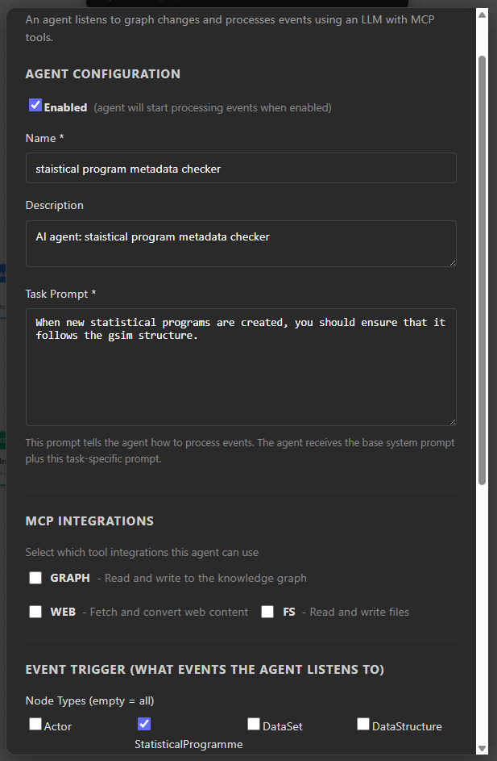
*The Create Agent dialog. Agent configuration, MCP integrations, and event trigger settings are defined in a single form.*

**Agent configuration:**

| Field | Purpose |
|-------|---------|
| **Enabled** | When checked, the agent begins listening to events immediately |
| **Name / Description** | Identification — the agent appears as a node in the graph |
| **Task Prompt** | Instructions added to the agent's base system prompt to define its behaviour |

**MCP Integrations** — which tool sets the agent may use:

| Integration | Capability |
|-------------|-----------|
| **GRAPH** | Read and write to the knowledge graph |
| **WEB** | Fetch and convert web content |
| **FS** | Read and write files |

**Event trigger** — filter which node types cause the agent to react (leave empty to
react to all node type changes).

Agents appear as Agent nodes in the graph. Double-clicking opens the detail dialog
where you can click **Edit**; right-click gives the same options via the context menu.

### 2.8 Recent nodes (navigation trail)

As you work, a **Recent nodes** button appears at the bottom-centre of the canvas
once anything has happened. It keeps a short, session-scoped trail of the nodes you
have **added** to the visualization (for example through search or *find related*)
and the ones you have **visited** — navigated to from search or opened via
double-click.

Click the button to expand the trail (newest first). Each entry shows the node's
name, whether it was added or visited, and how long ago. **Click an entry to jump
back to that node** — the canvas re-centres on it. Use the trash icon to clear the
trail, or **Esc** to close the panel.

Each node appears at most once: returning to a node you have already seen moves its
entry back to the top with a fresh time rather than adding a second row, so jumping
between two nodes does not push the rest of the session out of the trail. A node you
added keeps its **Added** label even after you return to it later.

This trail is per-session and lives only in your browser. It is separate from
**Recent activity** ([5.2](#52-recent-activity-audit-log)), whose Graph tab is a
persisted audit log of who changed what in the graph data (its Session tab is a
different, session-scoped record: this session's own annotation/canvas activity).

---

## 3. Search

The search bar at the top of the page searches across all node names, aliases,
descriptions, summaries, and tags in the graph (including federated graphs if
federation is enabled).

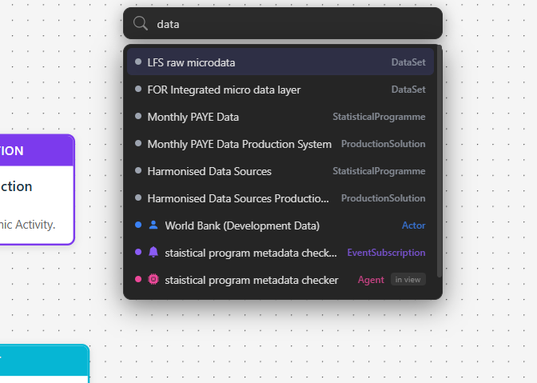
*Search results shown as a dropdown. Click a result to centre the canvas on that node and highlight it.*

**Tips:**
- Searches are fuzzy — partial words and approximate spellings are matched.
- Results show the node type alongside the name.
- Any node can carry **aliases / synonyms** (set them in the node editor). A node
  is found by its aliases too, so an abbreviation or alternate spelling still
  surfaces it — an alias match ranks just below a match on the node's real name.
- When multiple graphs are federated, results show a `<GraphName>: <NodeName>` prefix
  so you can tell which graph the result comes from.

---

## 4. AI Chat

Click the **→** arrow or the chat icon in the top bar to open the chat panel.

### 4.1 Asking questions

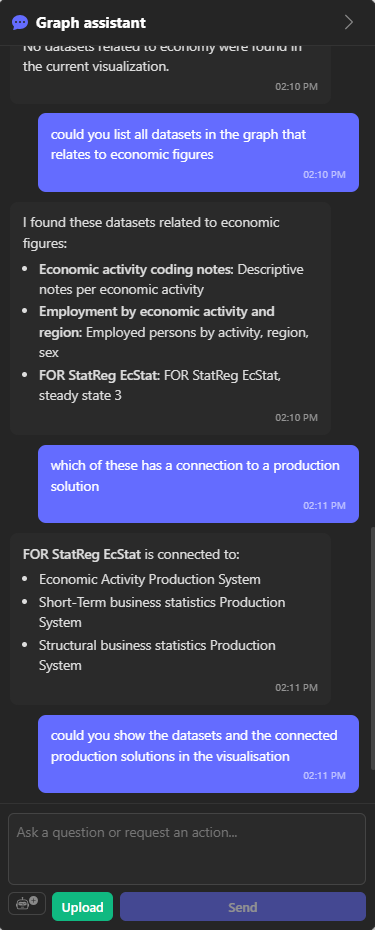
*The chat panel during a multi-turn conversation. The assistant can answer follow-up questions and load results directly into the canvas on request.*

Type any question in natural language. The assistant has full access to the graph:

> *"Which datasets are connected to the Labour Force Survey?"*
> *"Show me the production solutions for economic statistics."*
> *"What is the data structure for the employment dataset?"*

The assistant responds in whatever language you write in — switch mid-conversation freely.

Responses support **Markdown**: bold text, bullet lists, tables, and inline code are
rendered properly.

### 4.2 Adding nodes through chat

Ask the assistant to add content:

> *"Add a new initiative called 'Digital Identity Pilot' run by Skatteverket."*
> *"Create a connection between the LFS dataset and the NSI node for Sweden."*

Write operations go through the same validation as the UI — the node type must exist
in the current profile's schema.

### 4.3 Node proposals and duplicate detection

When the assistant extracts entities (from text or a document), it checks the graph
for similar existing nodes before proposing new ones.

You choose which proposals to **Approve** (adds to graph), **Link** (connects to an
existing match instead), or **Reject** (discard).

No nodes are added until you explicitly confirm them.

### 4.4 Skills

Skills are **Skill nodes** stored in the graph that contain domain-specific instructions.
Activating a skill in the chat adds those instructions to the AI assistant's context,
giving it specialised knowledge for a particular domain or task.

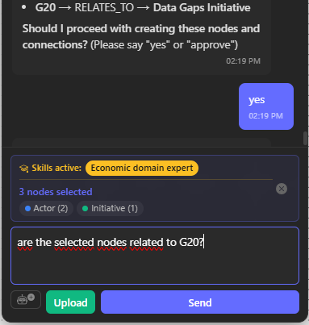
*Bottom of the chat panel showing an active skill ("Economic domain expert") and the currently selected nodes. Both are sent as context with every message.*

**Activating skills:**
Available skills appear as tags at the bottom of the chat input area. Click a tag to
activate or deactivate it. The active skill name is highlighted in the
**"Skills active:"** indicator.

**Selected nodes as context:**
When you select one or more nodes on the canvas, they appear as coloured pills in the
chat input (showing type and count). The assistant can then answer questions specifically
about those nodes without you having to name them.

> *Example: Select a ProductionSolution node, then ask "which datasets does this
> production system produce?" — the assistant already knows which node you mean.*

**Skills in context** — active skills and selected nodes are sent with every message.
You can switch skills or change the selection mid-conversation without starting over.

Skill nodes are created from the left toolbar (Skill node type) and edited like any
other node.

### 4.5 Node marking

The assistant can **visually annotate** nodes on the canvas with a colour dot and an
optional label. This is useful for highlighting a set of nodes by status, priority,
or any other temporary attribute.

> *"Mark all Actor nodes in red."*
> *"Mark Initiative nodes that relate to AI in green with the label 'AI-related'."*
> *"Remove all marks."*

A legend panel appears in the graph corner showing which colour maps to which label.

**Important:** Marks are session-only — they are never persisted to the graph and
disappear when you refresh the page.

### 4.6 Document upload

Click the **Upload** button (paperclip icon) in the chat input area to upload a
PDF, Word (.docx), or plain text file.

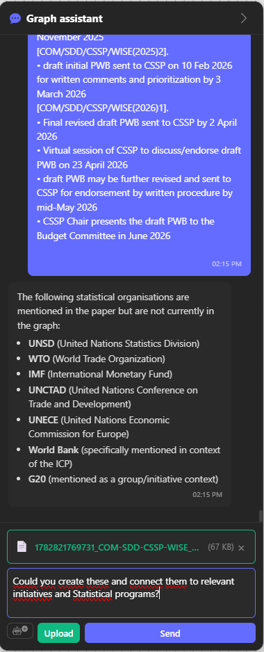
*After uploading a document, the assistant extracts entities and proposes them as new graph nodes, including suggested connections to existing content.*

Example workflow:
1. Upload a project description PDF.
2. The assistant extracts organisations, initiatives, and themes mentioned in the document.
3. It presents them as proposals with similarity scores against existing graph content.
4. You confirm which to add.

You can also ask questions about the uploaded document without extracting entities:

> *"What is the main goal of this document?"*
> *"List the organisations mentioned."*

### 4.7 Structured inputs in collection sessions

In an Active Knowledge Collection — the focused data-gathering assistant reached
through a collection link — the assistant can present interactive input controls
instead of asking for free text. When a question has a fixed set of choices or a
bounded numeric range, it renders **radio buttons**, **checkboxes**, **dropdowns**,
or a **slider** directly in the chat. This makes answering faster and keeps the
collected data consistent.


*The collection assistant presents a form with radio buttons, checkboxes, and a slider. The respondent answers with the controls and clicks Submit.*

When you submit a form, the assistant stores your answers as a structured
**CollectionResponse** — one record per submission, linked to the collection, with
a consistent field-by-field shape. Because every submission uses the same fields,
the responses for a collection can be compiled into simple aggregations or
statistics later (for example, counts per option). Ask the collection owner's
assistant to summarise the responses to see this in action.

By default, each CollectionResponse is also linked to every node the assistant
created or updated while handling that submission — so a submission that adds five
new organisations and updates three existing ones links the response to all eight.
This makes it easy to review the outcome of a single submission from its response
node. The collection owner can turn this off with the **Link created and updated
nodes to the response** option when creating or editing the collection.

Free-text answers still work at any time; the structured controls are offered only
where they make a question easier to answer.

---

## 5. Session menu and settings

The session menu includes **Fullscreen canvas**, which hides application chrome
while preserving the current canvas, selection, assistant, and drawer state.
Use the subtle return button or Escape to leave it. The shortcut is
Ctrl+Shift+F on Windows/Linux and Cmd+Shift+F on macOS. If browser fullscreen is
unavailable or denied, the same action automatically uses an in-app focus mode.

Click the **☰** (hamburger) icon in the top-left corner to open the session menu —
a panel that slides out from the left and docks to the screen edge. While it is open,
the toolbar shifts right so it keeps floating next to the panel.

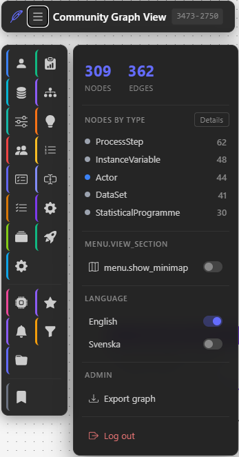
*The session menu with session navigation at the top, recent sessions in the middle,
and Settings at the bottom.*

Your work happens inside a **session** (the ID shown in the top bar). The session
menu lets you navigate between sessions, similar to how chats work in chat-based
AI apps:

| Item | Effect |
|------|--------|
| **Start new session** | Saves the current session automatically and opens a fresh, empty one |
| **Search previous sessions** | Filters the recent-session list by name or ID |
| **Connect to session (via ID)** | Joins an existing session by entering its ID (format `1234-5678-9012-3456`) |
| **Recent sessions** | The most recently used sessions — shown by name if you have named them, otherwise by ID. Click one to load it; the current session is saved automatically first. Hover a row and open the **⋮** menu for per-session actions: **Name session**, **Copy link** (copies the shareable `?session=…` URL to the clipboard), **Copy pulse-trigger URL** (on the session you are currently in — see [8.4](#84-external-pulse-triggers)), and **Delete session**. |
| **Recent activity** | Opens the activity panel — this session's annotation/canvas activity with undo, plus a read-only audit log of graph changes (see [5.2](#52-recent-activity-audit-log)) |
| **Lock / Unlock visualization** | Guards the current board against accidental clearing. While locked, **Esc × 2** does nothing at all, and the top-bar **clear** button asks for an emphatic confirmation warning that everything on the board will be removed. The setting is remembered in your browser. |
| **Settings** | Opens the Settings dialog (see below) |

Session content (node membership, positions, groups, and hidden nodes) is stored
**on the server**, so a session can be shared with others: the active session ID
is kept in the page URL (`?session=1234-5678-9012-3456`), and anyone who opens that URL —
or enters the ID via **Connect to session** — joins the same session. Your list
of recently visited sessions stays local to your browser; only the session
*content* lives on the server. The canvas is saved automatically while you work
and restored when you return to a session.

Switching sessions starts a fresh graph-assistant conversation: the chat history
and any active skills or experts from the previous session are cleared, and any
selected or opened node is reset, so nothing from one session carries over into
another.

Deleting a session removes its content for everyone. If you delete the session
you are currently in, a fresh empty session is created and you are switched into
it automatically, with a notice; the same happens if someone else deletes the
session you are in. Either way the new session starts clean in exactly the way
described above — no chat history, experts, or open node from the deleted session
follow you into it. When other people are connected to a session you delete, the
confirmation warns you how many are currently in it.

### 5.1 Collaborating in a session

Several people can work in the same session at the same time — just share the
session URL (or the session ID via **Connect to session**). Everyone sees the
same nodes, positions, groups and annotations, and changes appear for the others
within a fraction of a second. Each person still pans and zooms their own view;
only the content is shared, not the camera.

**Who else is here.** When at least one other person joins, a row of coloured
dots appears in the top bar next to the session ID — one dot per connected
person, each in that person's colour with the initial of their name. Hover a dot
to see the full name; your own dot is outlined in white.


*Coloured presence dots show who else is currently in the session.*

**Who is working on what.** When someone selects one or more nodes, those nodes
get a coloured outline and a small name badge in that person's colour on every
other participant's screen. This lets you see at a glance what a collaborator is
holding, so you can avoid grabbing the same node. These markers are advisory —
they never lock anything — and they disappear automatically when the person
deselects, leaves, or a short time passes without activity.

**Your name.** By default you appear as *Guest-1*, *Guest-2*, and so on. Set a
recognisable name under **Settings → Your presence → Display name**; it is shown
to everyone in the roster and on your selection badges. The name is stored in
your browser and takes effect the next time you open or switch session.

**Reconnecting after a dropped connection.** If your connection drops — a
network blip, closing your laptop, a poor signal — any edits you made while
offline are kept locally and delivered once you reconnect; they are not lost.
When the app reconnects and recovers edits made while you were offline, it
shows a brief "Reconnected — restored N change(s) made while offline"
notification.

### 5.2 Recent activity (audit log)

Open **Recent activity** from the bottom of the session menu to see the activity
panel. It slides in from the right edge of the screen and has two tabs:
**Session** (this session's annotation and canvas activity — sticky notes, shapes,
node moves, layout changes, dimming/restoring nodes or connections, edge-intensity
changes — with undo) and **Graph** (a read-only log of
everything that has changed in the graph itself, newest first). They are
deliberately separate: session activity lives with the session and disappears
with it; graph history is the permanent audit trail.


*The activity panel's Session tab, with a readable description per action and an
**Undo** button on your own latest undoable action.*

#### Session tab

Every annotation or canvas change you or a collaborator makes in the current
session appears here as a plain-language entry — "Created a sticky note",
"Moved \"Acme Corp\"", "Rotated a shape", "Raised the layer of a shape" — with
who did it (your own actions are marked *(You)*) and when. The entry names what
actually changed: moving an annotation reads as a move and changing its layer as
a layer change, distinct from locking or unlocking it.

- **Undo** appears only on *your own* most recent undoable action — you can
  never undo someone else's change. The same action is also available as
  **Undo my last action** above the list.
- If the item you are trying to undo has changed since (someone else edited it,
  or you did something else to it first), undo fails with a clear conflict
  message instead of silently overwriting that later change.
- If someone else currently has that item selected, undo waits rather than
  reaching through them: you are told to try again in a moment, and it works
  once they click away. This one is temporary — unlike the conflict above, the
  action stays undoable.
- Session activity is kept for 7 days or the last 500 actions per session,
  whichever comes first — it is not a permanent record.

#### Graph tab

The graph tab lists graph changes newest-first, with an **AI** badge on changes
made by an agent. Each entry shows:

- **What happened** — node or connection created, updated, or deleted.
- **When** — a relative time (e.g. "5 min ago") with the exact date and time
  underneath.
- **Which item** — the entity's type and name (or ID).
- **Where it came from** — the origin of the change (for example `web-ui` or
  `mcp`), shown as *via …*.
- An **AI** badge when the change was made by an AI agent rather than a person.

For an update, a compact **before → after** diff lists the fields that changed.
Use **Load more** at the bottom to page further back through the history, and the
refresh icon in the header to reload from the top (it reloads whichever tab is
open). This view never changes the graph — it is purely for looking back at what
happened.

History is also available per item: double-click a node (or open a connection's
editor) and switch to the **History** tab to see only that item's changes. When a
standalone graph has no recorded history yet, the panel simply shows that there is
no activity.

### Settings dialog

The settings that previously lived directly in the app menu are now in the
**Settings** dialog, opened from the bottom of the session menu.

#### Graph statistics

The top of the dialog shows the total number of nodes and edges currently in the graph,
followed by a colour-coded breakdown by node type. If there are more than five types,
a **Details** button opens a full node-type statistics dialog.

#### Metamodel explorer

**Explore metamodel** opens an interactive, read-only view of the graph's active
schema — the node types and relationship types this deployment is configured with,
rendered as a network you can pan and zoom. Click a node type to see its
description, fields and current node count; relationship types are drawn as
directed, labelled connections between the node types they are configured to
apply to. Relationship types with no configured source/target rule are listed
separately rather than drawn to every node type, since no rule was actually
configured. A **Table** tab presents the same information as two accessible
data tables, for screen readers or a quick text scan. This view never lets you
change the schema — editing the metamodel is not part of the open-source core.

#### View settings

| Option | Effect |
|--------|--------|
| **Show minimap** | Toggle the minimap overlay in the bottom-right corner of the canvas |
| **Show node preview popup** | Toggle the hover info popup that previews a node's details. Turn it off if the popup gets in the way. |
| **Edge intensity** | A slider setting the baseline visibility for every connection in this session. Dimmed connections (see [2.4](#24-right-click-context-menu)) always render below this baseline — lowering it fades the whole graph's connections together, while dimming still singles out specific ones underneath that. |
| **Assistant panel open** | Toggle the chat panel between expanded and collapsed. Your choice is remembered in the browser and used every time you return, overriding this deployment's configured startup default. Click **Reset to default** underneath to forget your choice and go back to that default. |

#### Your presence

| Option | Effect |
|--------|--------|
| **Display name** | The name shown to other people collaborating in the same session (see [Collaborating in a session](#51-collaborating-in-a-session)). Leave it empty to appear as a numbered guest. |

#### Language

The UI is temporarily English-only; the language switcher is not shown in
Settings while this is in effect.

The AI assistant always responds in the language you write in, regardless of the
UI language.

#### Admin

| Action | Description |
|--------|-------------|
| **Export graph** | Downloads the full graph as a JSON file |
| **Log out** | Signs you out (only relevant when authentication is enabled) |

---

## 6. Federation — searching across multiple graphs

When the application is connected to one or more remote graphs, a **depth selector**
appears next to the minimap in the lower-right corner of the canvas.

| Depth | What is searched |
|-------|-----------------|
| 0 | Local graph only |
| 1 | Local + directly configured remote graphs |
| 2+ | Local + graphs reachable via configured remotes |

**Federated results** are visually distinguished in search results and the graph:
- Node labels show `<GraphName>: <NodeName>` when results come from a remote graph.
- Federated nodes have a provenance badge indicating their source graph and distance.

Changing the depth only affects your current search and view — it does not change
what is permanently stored in the local graph.

**Node adoption:** If you want to permanently link a local node to an entity
from a remote graph, right-click the federated node and choose **Adopt** (if available).
This creates a local copy with an `ADOPTED_FROM` reference to the original.

---

## 7. Interactive guides

The app includes step-by-step guided tours triggered via URL parameter or by the
AI assistant.

**Start a guide via URL:**
```
https://your-app/web/?guide=first_intro
```

**Start a guide via the assistant:**
> *"Start the introduction guide."*

Guides display a floating tooltip that walks you through UI elements one step at a time.
Use **Next** / **Enter** to advance, **Escape** to cancel.

Available built-in guides are configured in `schema_config.json` under
`presentation.guides`. Administrators can add custom guides without code changes.

---

## 8. Connecting external AI tools via MCP

The application exposes its graph operations as a **Model Context Protocol (MCP)**
server. This lets external AI assistants (Claude, ChatGPT, Open WebUI, etc.)
interact with the graph directly — search, read, and write nodes — from their own
interface.

### 8.1 Available MCP tools

| Tool | Description |
|------|-------------|
| `search_graph` | Search nodes by query string |
| `get_node_details` | Get full details for a specific node |
| `get_related_nodes` | Get nodes connected to a given node |
| `find_similar_nodes` | Find nodes with similar names/descriptions |
| `add_nodes` | Add new nodes and edges |
| `update_node` | Update node properties |
| `delete_nodes` | Delete nodes by ID |
| `get_graph_stats` | Get summary statistics about the graph |
| `save_view` | Save a named canvas view |
| `get_capabilities` | Discover what the server supports |
| `connect_to_visualization_session` | Check that a session ID resolves, and whether a client is connected to it |

### 8.2 Connecting

The MCP endpoint is available at:

```
https://your-server/mcp
```

Legacy SSE clients (older MCP protocol) can use:
```
https://your-server/mcp/sse
```

**SSPCloud users:** See [SSPCloud-setup.md](./SSPCloud-setup.md) for step-by-step
instructions on connecting from Claude or ChatGPT.

**Authentication:** If `MCP_BASIC_AUTH=true` is configured server-side, the MCP
endpoint requires Basic Auth credentials. The web GUI and REST API remain unprotected
in this mode (suitable for Cloud Run + IAP deployments).

### 8.3 Live visualization control via session ID

Each session has a **session ID**, shown in the top bar next to the application
title (e.g. `3953-2493`) and reflected in the page URL (`?session=3953-2493`). The
ID targets a shared, server-stored session: an external AI connected via MCP can
use it to push results directly into that session's canvas — in real time, while
you watch — and anyone who opens the same URL or connects by ID sees the same
content.

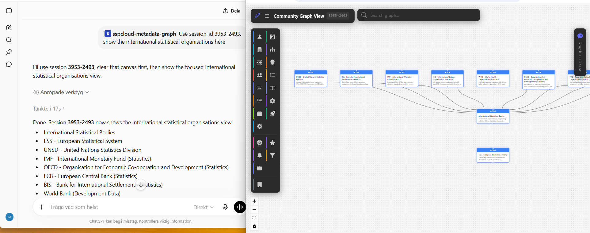
*ChatGPT with the graph's MCP tool connected. The user tells it "Use session-id 3953-2493 — show the international statistical organisations here." The AI calls MCP tools and the nodes appear live in the browser on the right.*

**How it works:**

1. Open the app in your browser — note the session ID in the top bar.
2. In your external AI assistant (Claude, ChatGPT, etc.), connect to the MCP server.
3. Tell the assistant the session ID and what you want to see:
   > *"Use session-id 3953-2493. Show the international statistical organisations."*
4. The assistant calls `connect_to_visualization_session` with your session ID, then
   uses tools like `search_graph` and `get_related_nodes` to fetch data and push the
   result to your browser window.

The canvas updates in real time — nodes appear, edges are drawn, and the layout
adjusts automatically, all driven by the external AI without any manual work in
the browser.

When the assistant **arranges** the view — laying nodes out as a left-to-right
flow, a grid, or swimlanes — the whole batch glides smoothly into place rather
than jumping node by node, and a small *"Assistant is arranging the view…"* badge
appears at the top of the canvas while it moves. You can keep dragging a node
during an arrange; the assistant's layout leaves whatever you are holding
untouched. If your system is set to **reduce motion**, the nodes snap straight to
their final positions instead of animating.

**Use cases:**

- Use a powerful external assistant (e.g. a model with extended context or web access)
  to drive complex graph explorations while you observe and interact in the browser.
- Combine natural-language queries from one AI with graph navigation in another tool.
- Share your session ID with a colleague who can then direct the visualization from
  their own AI assistant, in a collaborative session.

### 8.4 External pulse triggers

Beyond AI-driven control, any external system can make a single node **pulse** —
briefly glow, grow, or run a marker around its border — to draw your attention to
a live event, such as a new customer registering or a new dataset version being
created.

**How it works:**

1. In the session menu (**☰**), open the **⋮** menu on the session you are
   currently in and choose **Copy pulse-trigger URL**. This copies a dedicated,
   authenticated trigger URL to your clipboard.
2. Configure an external system (a webhook, an automation, a small script) to send
   an HTTP `POST` to that URL when its event fires, with a JSON body naming the
   node to react:

   ```json
   { "node_id": "customer-42", "style": "glow" }
   ```

   `style` is optional (`glow`, `grow`, or `marker`; defaults to `glow`), as are
   `color` and `duration_ms`.
3. The named node pulses in your open visualization the moment the URL is called —
   and for everyone sharing the session.

The URL carries a secret token scoped to the live session, so only systems you
hand it to can trigger a pulse. Choosing **Copy pulse-trigger URL** again issues a
fresh token and **revokes** the previous URL. The token lives only as long as the
session, so a trigger URL stops working once the session ends. If your system is
set to **reduce motion**, a triggered node shows a static highlight instead of an
animation.

---

## 9. On a phone

On a phone-sized screen (roughly 768 px wide and below) the canvas swaps its
desktop chrome — the header, search bar, toolbar, chat panel and session
menu — for a layout that fits a thumb.

**Navigation.** A compact top bar replaces the desktop header, and a six-slot
bottom navigation bar replaces the toolbar and the hamburger menu:

| Slot | Effect |
|------|--------|
| **Graph** | Closes any open panel and returns to the full-screen canvas |
| **Search** | Opens the graph search in a sheet that slides up from the bottom |
| **Create** | Opens the node-type picker in the same bottom sheet, for adding a
graph node (an Actor, Initiative, and so on) |
| **Annotate** | Opens the annotation toolbox — notes, text, labels, frames,
shapes, icons, vote dots, images and freehand drawing — in its own bottom
sheet. Kept as a separate slot from **Create** on purpose: an annotation is a
mark on the canvas, not a graph node, and the two creation flows stay visually
and behaviorally distinct even though both live behind the same style of
sheet |
| **Chat** | Opens the AI assistant (only shown when it is available) |
| **Menu** | Opens the session menu — the same panel described in
[section 5](#5-session-menu-and-settings), as a full-width overlay with a
dimmed scrim behind it on a phone, rather than the narrower panel desktop
uses. Tap the scrim, tap the **✕**, or press **Escape** to close it. |

Only one of these is ever open at a time — opening one closes whatever else was
open, so the canvas is never covered by more than one panel at once. On a phone
the annotation toolbox is *only* reachable through the **Annotate** slot; unlike
on desktop, it does not also float over the canvas as a small always-visible
strip, so it never competes with the bottom navigation for space.

**Canvas controls.** The desktop zoom cluster is replaced by a compact pill in
the bottom-right corner with four touch-sized buttons: **zoom in**, **zoom out**,
**fit whole graph**, and **focus**. The minimap is not drawn at this width even
if you have switched it on under Settings — it would cover a large share of the
screen. Switching back to a wider screen restores the desktop controls and your
minimap setting; nothing is changed permanently.

Fitting the graph also frames it more tightly than on desktop, so a fitted graph
fills the screen instead of sitting in a wide margin.

**Focus view.** A large graph is hard to read on a phone, so you can narrow the
canvas to one node at a time:

1. Tap a node to select it. The **focus** button (◎) in the pill becomes active.
2. Tap **focus**. The canvas now shows only that node and the nodes directly
   connected to it, arranged in a ring around it.
3. Tap the same button again to return to the whole graph.

The focus view is a lens, not an edit. Leaving it puts every node back exactly
where it was, including nodes inside groups, and your notes, labels and arrows
come back with them — they are set aside while you are focused so the view frames
the ring rather than an annotation parked elsewhere on the canvas. The focus
layout itself is never saved: while you are focused, the canvas saves the view
you focused *from*, so an autosave or a session switch records your real layout
rather than the temporary one.

Because annotations are set aside, you cannot add a note, label or arrow while
focused — leave the focus view first. Everything else works as usual.

Focus needs a single node selected; it is not offered for notes, labels, arrows
or groups. The canvas returns to the full graph on its own if the node you are
focused on is removed, if you switch to another session, or if the screen stops
being phone-sized — turning a phone to landscape ends the focus view rather than
leaving you in it without the controls to get out.

---

## Appendix: Keyboard shortcuts

| Shortcut | Action |
|----------|--------|
| **Delete** | Delete selected node or edge |
| **Enter** (chat) | Send message |
| **Escape** | Cancel guide / close dialog |
| **Esc × 2** | Clear the canvas (remove all nodes from view). On a **named** session this first asks for confirmation; on a **locked** visualization it does nothing (unlock it, or use the clear button). |
| **Ctrl+Z** / **Cmd+Z** | Undo the last node move (drag, Organize, or Align/Distribute) |
| **Ctrl+Shift+Z** / **Cmd+Shift+Z** / **Ctrl+Y** | Redo the last undone move |
| **Space + drag** | Pan the canvas |
| **Scroll wheel** | Zoom in/out |

---

## Appendix: Screenshot checklist

Screenshots for this guide are saved to `docs/images/` in PNG format.

| Filename | Status | What it shows |
|----------|--------|---------------|
| `ui-overview.png` | ✓ | Full app with graph, toolbar, search, and chat panel |
| `toolbar.png` | ✓ | Left toolbar with node type icons |
| `create-node.png` | ✓ | Create node dialog with fields filled in |
| `create-edge.png` | ✓ | Canvas showing edge creation in progress |
| `context-menu.png` | ✓ | Right-click menu on a node, custom action visible |
| `search.png` | ✓ | Search bar with dropdown results |
| `chat-panel.png` | ✓ | Chat panel with a multi-turn conversation |
| `node-proposal.png` | pending | Node proposal dialog with similarity matches |
| `node-marking.png` | pending | Canvas with colour marking dots and legend |
| `document-upload.png` | ✓ | Chat after file upload with extracted entity proposals |
| `hamburger-menu.png` | ✓ | Session menu (☰) — left panel with session navigation and Settings entry |
| `recent-activity.png` | pending | Recent activity panel (right side), Session tab: entries with an Undo button and an actor badge |
| `create-agent.png` | ✓ | Create Agent dialog with all configuration sections |
| `skills.png` | ✓ | Chat panel bottom showing active skill and selected nodes |
| `mcp-session-control.png` | ✓ | External AI (ChatGPT) controlling the canvas via session ID |
| `federation-depth.png` | pending | Canvas depth selector (requires federation-enabled instance) |
| `mobile-canvas-controls.png` | pending | Phone viewport with the compact zoom/fit/focus pill in the bottom-right corner |
| `mobile-focus-view.png` | pending | Phone viewport in focus view — one node ringed by its direct neighbours |
| `mobile-bottom-nav.png` | pending | Phone viewport showing the compact top bar and the six-slot bottom navigation |
| `mobile-create-sheet.png` | pending | Phone viewport with the Create bottom sheet open over the canvas |
| `mobile-annotate-sheet.png` | pending | Phone viewport with the Annotate bottom sheet open, showing the expanded annotation toolbox grid |
| `mobile-session-menu.png` | pending | Phone viewport with the session menu open as a full-width overlay and scrim |
| `metamodel-explorer.png` | pending | Metamodel explorer network view with a node type selected and its detail panel open |
